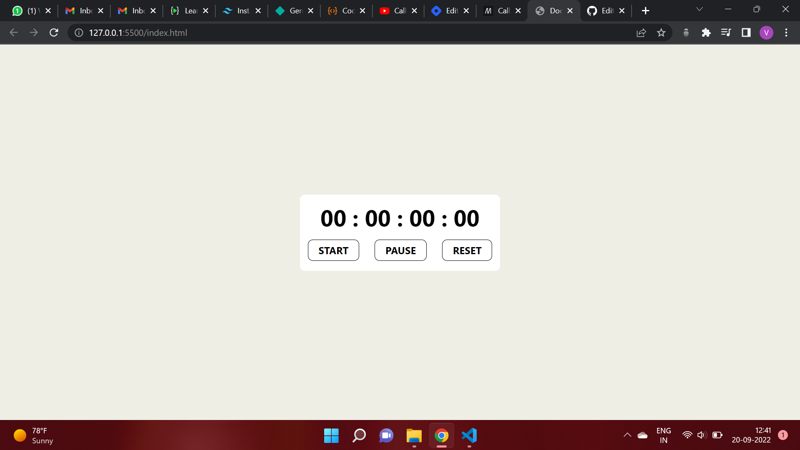

# **Stopwatch App using the Vanilla JS**
## **Overview**
This is a stopwatch application will allows a user to use a stopwatch feature like running, pausing and reseting the timer just by clicking over the respective button. 
It has a simple UI having three buttons for Starting, Pausing and Reseting the timer by a single click.

## **Technology Used**
1. HTML
2. Tailwind CSS
3. JavaScript

## **Output**

## **Live Link**
